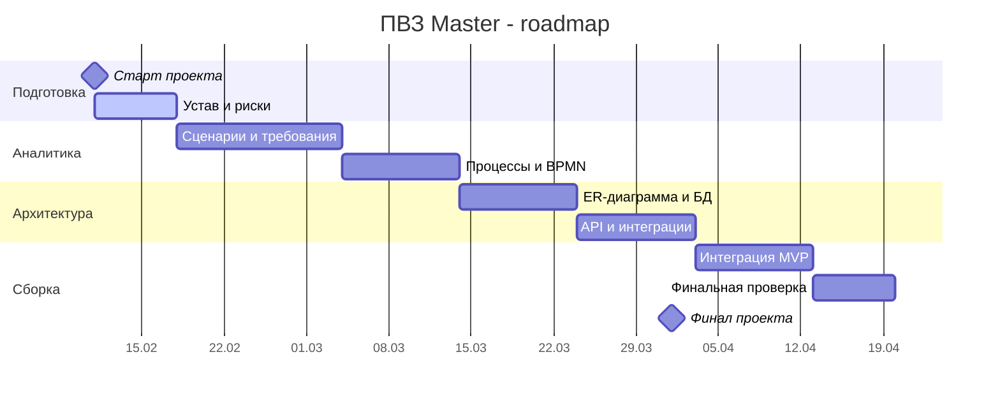

# Дорожная карта проекта

Ниже приведена упрощенная дорожная карта в формате Gantt.

## Контрольные точки

- **CP1:** 2026-02-18
- **CP2:** 2026-03-11
- **CP3:** 2026-03-25
- **CP4:** 2026-04-01

## Принципы планирования

- сначала фиксируются требования и границы MVP;
- затем уточняются процессы и архитектура;
- после этого команда переходит к интеграции и финальной проверке.

