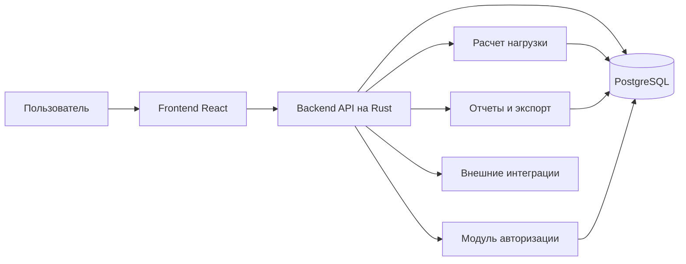

# Архитектурная схема системы

Схема показывает основные слои системы ПВЗ Master.

## Состав системы

- **Frontend**: интерфейсы для просмотра ПВЗ, операций, отчетов и настроек.
- **Backend**: бизнес-логика, расчетные правила, авторизация, API.
- **Database**: хранение ПВЗ, сотрудников, операций, логов и отчетов.
- **Integration layer**: точки подключения к внешним источникам, если они включены в сценарий.

## Основные потоки данных

1. Пользователь открывает экран в браузере.
2. Frontend вызывает backend API.
3. Backend проверяет права и получает данные из БД.
4. Модуль расчета определяет текущую нагрузку.
5. Результат возвращается в интерфейс и может попасть в отчет.

## Ключевые свойства

- единая точка доступа через API;
- разделение интерфейса, логики и хранения данных;
- возможность расширять отчеты без переписывания клиентской части;
- согласованность с ER-моделью и структурой БД.

