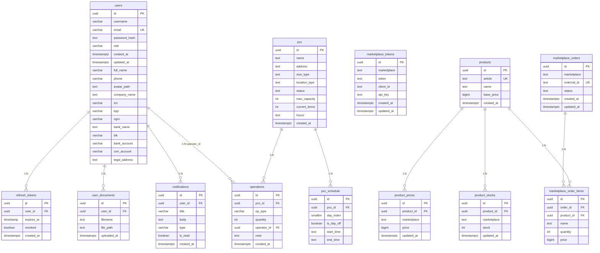

# Схема базы данных

Ниже приведена актуальная ER-схема базы данных проекта по миграциям `backend/migrations`.

## Основные сущности

- `users` - пользователи системы и их профильные данные.
- `pvz` - пункты выдачи заказов.
- `operations` - журнал операций по ПВЗ.
- `pvz_schedule` - расписание работы ПВЗ по дням недели.
- `refresh_tokens` - токены обновления сессии.
- `notifications` - уведомления пользователям.
- `products`, `product_prices`, `product_stocks` - каталог товаров и данные по маркетплейсам.
- `marketplace_orders`, `marketplace_order_items` - заказы и строки заказов маркетплейса.

## Примечание

Схема построена по SQL-миграциям в `backend/migrations` и отражает текущую структуру БД проекта.

